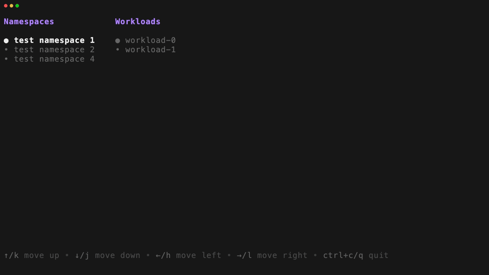

# LogViewer TUI

LogViewer is a Terminal User Interface (TUI) application designed to facilitate the viewing of logs from Kubernetes or Docker containers. It provides an interactive and real-time experience for managing and troubleshooting your containerized applications.

## Features

- **Interactive List Navigation**: Seamlessly browse Kubernetes namespaces, workloads, pods, and containers using keyboard controls.
- **Real-time Logs Viewing**: Effortlessly stream logs from selected Docker or Kubernetes containers.
- **Customizable Display**: Use a TOML configuration file to filter and customize the namespaces and logs you wish to view.

## Installation

To install LogViewer, ensure you have Go installed on your system and then run the following command:

```bash
go install github.com/filipecaixeta/logviewer/cmd/logviewer@latest
```

## Usage

After installation, you can start using LogViewer by simply typing `logviewer` in your terminal. LogViewer offers several subcommands for interacting with different environments:

```bash
# Interact with Kubernetes clusters
logviewer k8s

# Interact with Docker containers
logviewer docker

# Read from standard input (experimental)
logviewer stdin
```

## Configuration

LogViewer determines which configuration file to use following this order:

1. A file specified by the `LOGVIEWER_CONFIG` environment variable.
2. A `config.toml` file in the current working directory.
3. A `config.toml` file in the user's home directory.

You can also explicitly specify a configuration file using the `--config` flag:

```bash
logviewer --config path/to/your/config.toml
```

A template can be found at [config.template.toml](config.template.toml) within the repository.

The configuration options allow you to set themes, specify namespaces, and define filters and transforms for your log data.

## Demo

Here's a quick look at LogViewer in action:



## Contributing

Contributions to LogViewer are welcome! Please refer to the repository's issues page to report bugs or suggest features.

## License

LogViewer is open-sourced software licensed under the [MIT License](LICENSE).
